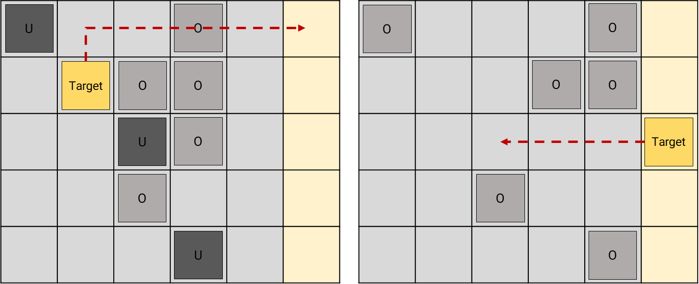
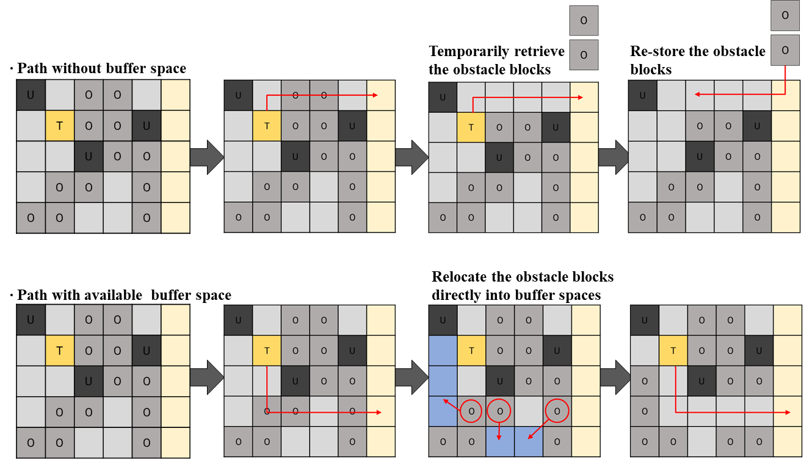
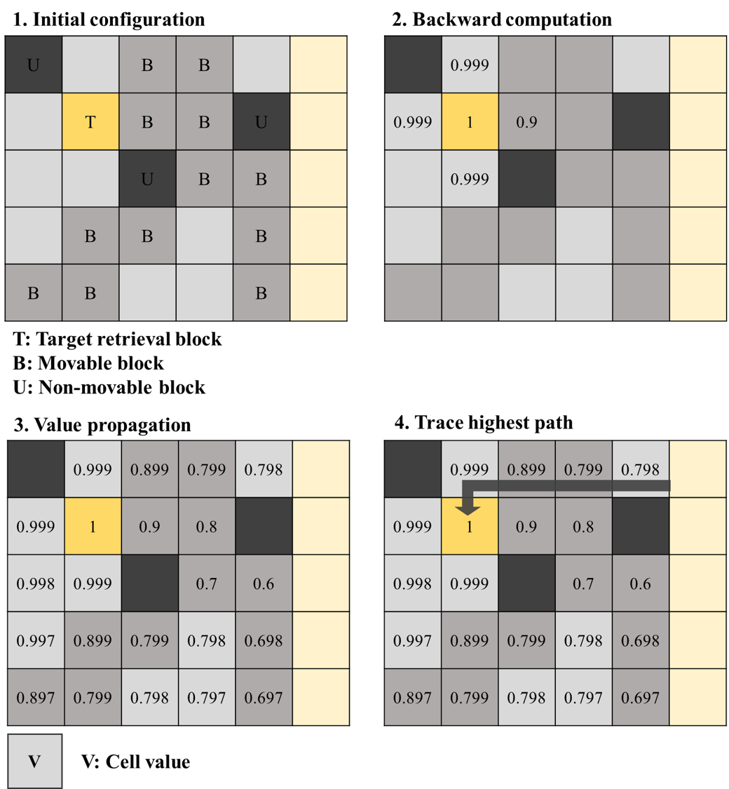
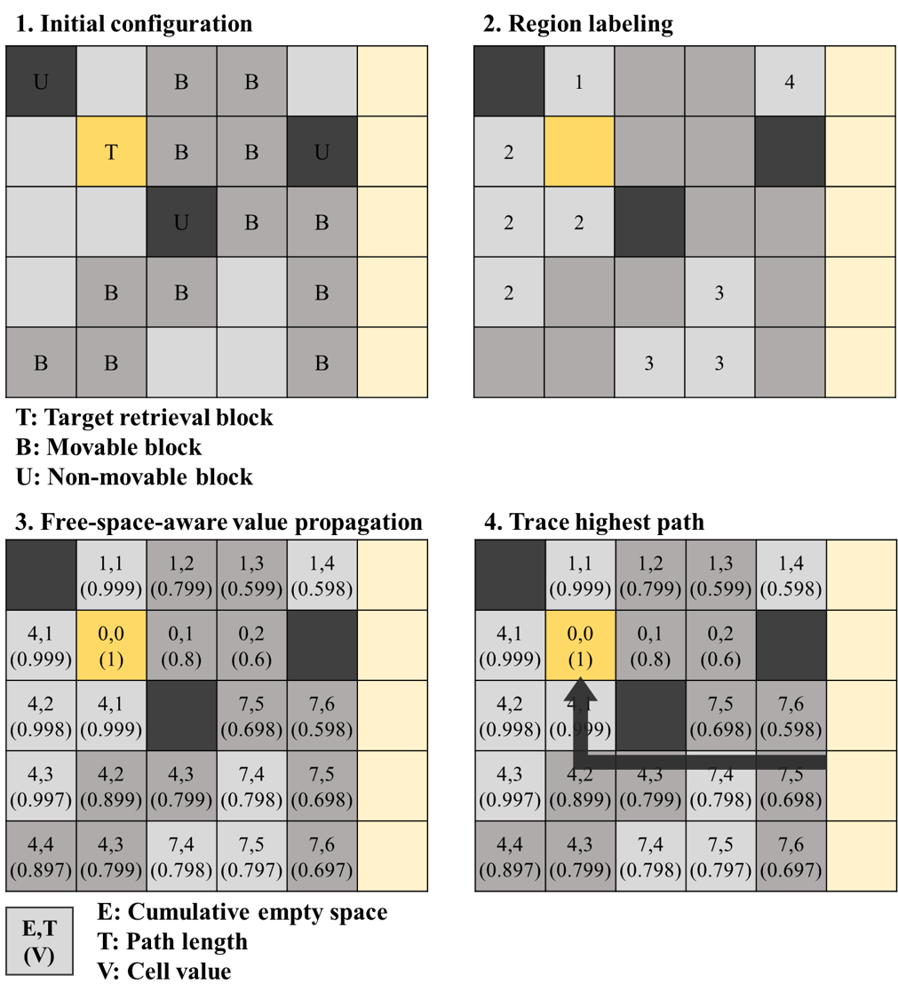

# 2025_BRP_RL

|                 Developer                |       
| :--------------------------------------: |  
| [Seung Woo Han](https://github.com/SeungwooHH11) | 
|         🧑‍💻 AI-Development               |         
 

## Project Overview
- **Project**
    - Retrieval and placement optimization in shipyard hull-block storage yard
- **Superviser**
    - Prof. Jong Hun Woo (SNU, KOREA)
- **Paper**
    - Optimization of Hull-block Placement and Retrieval Path Planning for Congested Planar Storage in Shipyard
    - Transportation part E (Preparing submitting)
 

## Project Introduction
We propose a **retrieval path planning and placement decision algorithm** aimed at minimizing the relocation of interference blocks. 
- Effective operation of the storage yard is a critical aspect of shipyard logistics. 
- Due to planar transportation constraints of hull blocks, interference block relocation often occurs during retrieval.  
- To address this, we develop a retrieval path planning algorithm based on dynamic programming and a placement algorithm based on graph reinforcement learning. 

 

## Main

### 1️⃣ Retrieval process

#### 1.1 Block retrieval process with blocking item relocation

 
 

### 2️⃣ Retrieval algorithm

#### 2.1 Minimum blocking path plannig algorithm

 

#### 2.2 Buffer-aware path planning algorithm

 

 

### 3️⃣ Placement algorithm

#### 3.1 Simulated Greedy Placement
- Greedy placement algorithm based on retireval simulation
    - **Placement rule**: 
        - Temporarily place the block in each candidate location
        - Simulate the retrieval of all earlier outbound blocks
        - Calculate the average number of relocations
    
#### 3.2  Graph reinforcement learning

##### 3.2.1 State
- State composed of current storage yard and incoming block
    - **Storage yard**: Model the grid form into graph structure
        - nodes representing cells with storaged block duration and weight
        - edges representing the adjacent connection between each cell
    - **Incoming block**: Feature containing of 
    - **Cardinal Graph Neural Network**: Proposed graph network structure suited for grid form graph

##### 3.2.2 Action
- Decide the placement location of incoming block
    - **Policy computation**
        - Encoded graph using graph neural network
        - Compute each cell value with softmax normalization

##### 3.2.3 Reward
- The objective is to minimize total block relocations, which are evaluated through simulation.
- A proxy reward is designed using a reward decomposition method:
    - **penalty cost**: A penalty is assigned to a placement action if the placed block was previously relocated
 

##### 3.2.4 Network Structure

- **Representation module**
    - Two types of latent representation are extracted from the heterogeneous graphs and auxiliary matrix, respectively
    - For heterogeneous graphs, the embedding vectors of nodes are generated using the relational information between nodes
    - For an auxiliary matrix, the embedding vectors for combinations of quay-walls and vessels are generated using the MLP layers 
- **Aggregation module**
    - Input vectors for the output model are generated based on the embedding vectors from the representation module
- **Output module**
    - The actor layers calculate the probability distribution over actions $\pi_{\theta} (\cdot|s_t)$
    - The critic layers calculate a approximate state-value function $V_{\pi_{\theta}} (s_t)$, respectively
